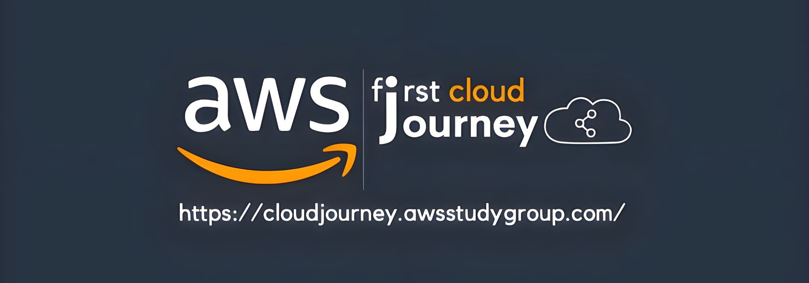
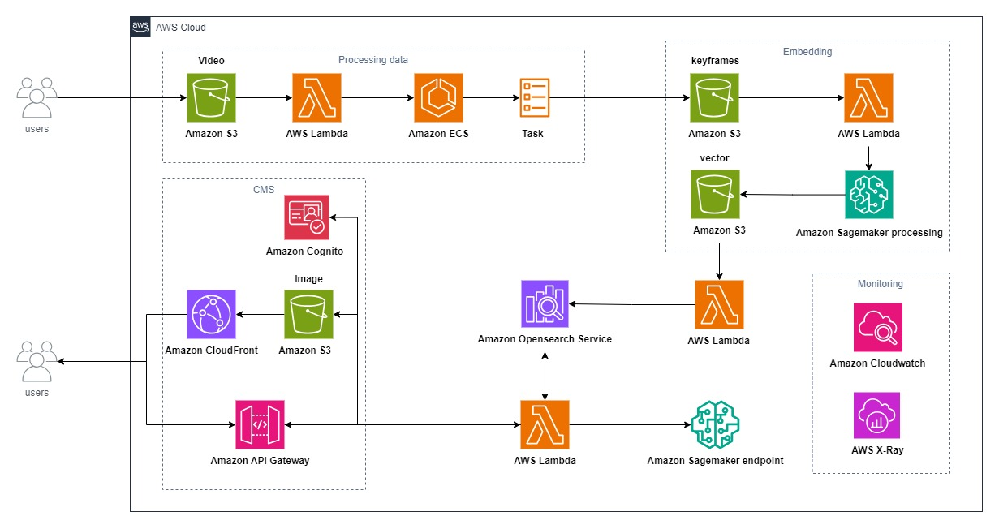

# AWS Workshops FCJ 2024

## 1. Introduction
Welcome to the workshops of the AWS FCJ 2024 program! These workshops are designed to help participants learn, enhance their skills, and dive deeper into AWS and AI/ML technologies. Through lessons and hands-on practice, participants will have the opportunity to gain a comprehensive understanding of AWS services, apply them in real-world projects, and build innovative solutions using AI/ML. Join us to explore new knowledge and experience the exciting challenges that await!
## 2. Workshops
### 2.1 Workshop 1: Semantic Video Search VectorDB

- Link workshop : [vantu-fit.github.io/semantic-video-search/](https://vantu-fit.github.io/semantic-video-search/)
- Source code: [github.com/vantu-fit/semantic-video-search](https://github.com/vantu-fit/semantic-video-search)